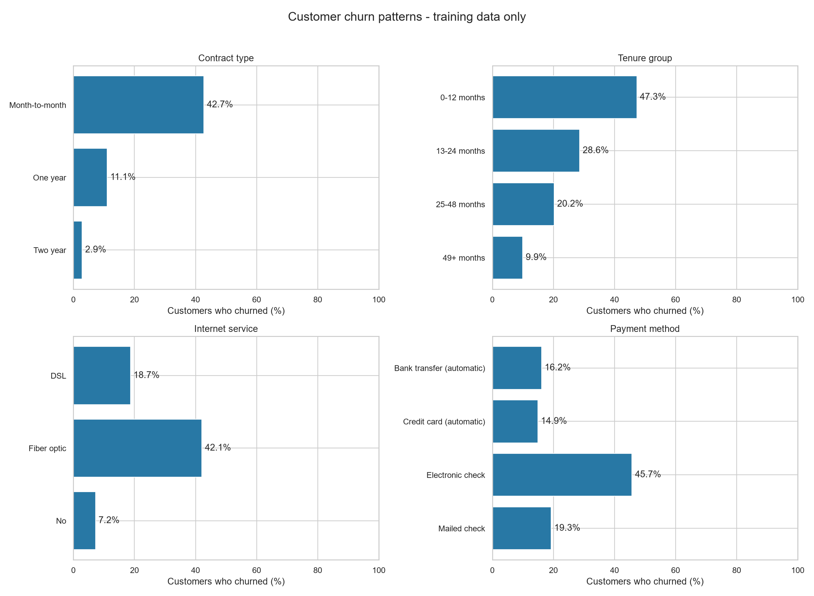
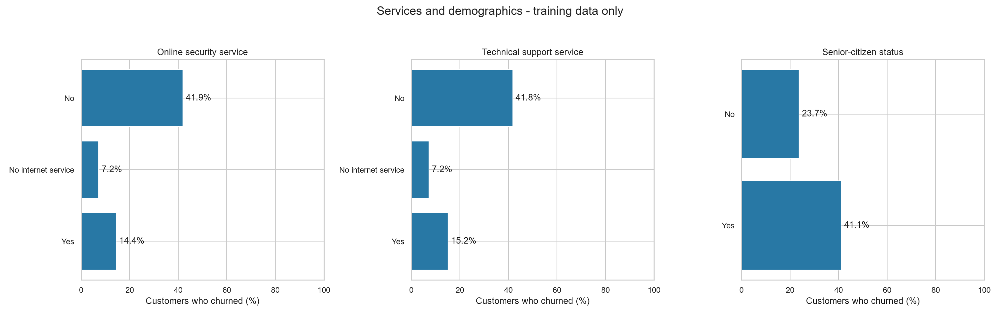
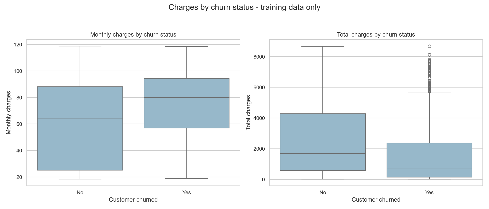
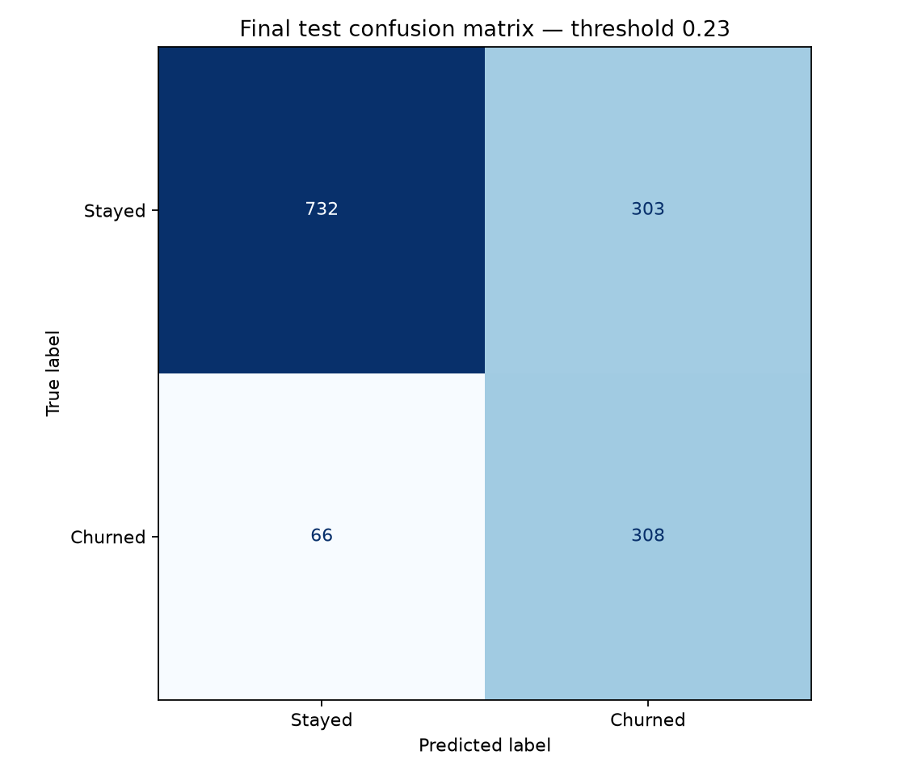
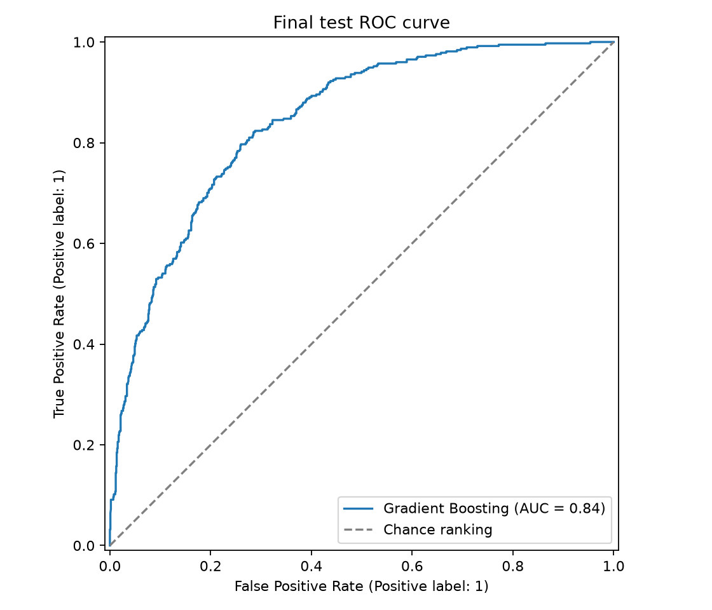
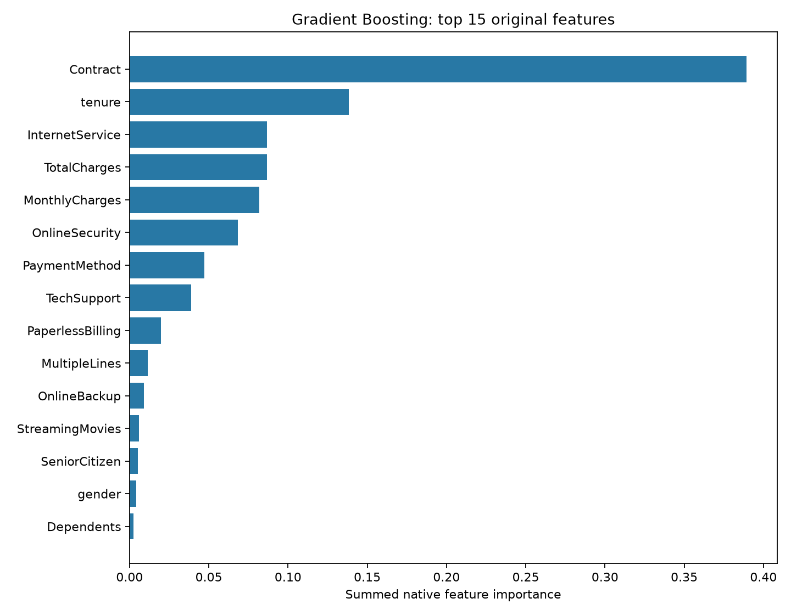

# Customer Churn Prediction System

An end-to-end machine-learning project that predicts whether a telecom customer is at risk of churning. The project includes reproducible data preparation, focused exploratory analysis, leakage-safe preprocessing, model comparison, threshold selection, final holdout evaluation, explainability, automated tests, and an interactive Streamlit application.

## Live application

**Live application:** [Open the Customer Churn Prediction System](https://customer-churn-prediction-system-cmcuedqx69t5ernatmwcwh.streamlit.app/)

## Project status

The implementation and local verification are complete:

- Raw-data validation and exploratory analysis
- Reproducible stratified train/test split
- Leakage-safe numerical and categorical preprocessing
- Comparison of Logistic Regression, Balanced Logistic Regression, Random Forest, and Gradient Boosting
- Training-only model and decision-threshold selection
- Evaluation on an untouched final holdout set
- Global feature-importance analysis
- Saved end-to-end prediction pipeline
- Validated Streamlit prediction interface
- Dataset and model-artifact integrity verification
- Reproduction check in a separate project copy
- 23 automated tests passing
- Ruff static checks passing

## Business objective

The system identifies customers who may leave so that a business can prioritize account reviews and retention outreach. The selected threshold intentionally favors churn recall while maintaining at least 50% precision.

Predictions do not guarantee an outcome, establish why a customer may leave, or determine which intervention will prevent churn. Business profitability has not been evaluated.

## Dataset

This project uses the IBM Telco Customer Churn sample dataset.

- Source repository: [IBM Telco Customer Churn](https://github.com/IBM/telco-customer-churn-on-icp4d)
- Source CSV: [Telco-Customer-Churn.csv](https://raw.githubusercontent.com/IBM/telco-customer-churn-on-icp4d/master/data/Telco-Customer-Churn.csv)
- Records: 7,043
- Columns: 21
- Identifier: `customerID`
- Target: `Churn` (`Yes` = 1, `No` = 0)
- Churned customers: 1,869 (26.54%)
- Customers who stayed: 5,174 (73.46%)

The source repository provides an Apache-2.0 license. The raw dataset is preserved unchanged and is intentionally excluded from Git. A verified copy can be downloaded with:

```powershell
Set-Location "C:\path\to\customer-churn-prediction-system"
.\.venv\Scripts\python.exe -m src.download_data
```

Expected source SHA-256:

```text
16320c9c1ec72448db59aa0a26a0b95401046bef5d02fd3aeb906448e3055e91
```

The downloader validates this fingerprint and refuses to overwrite an existing file with different content. Additional source and integrity details are available in [`data/README.md`](data/README.md).

## Data audit and split

- No exact duplicate rows
- No duplicate or missing customer IDs
- Eleven whitespace-only values in `TotalCharges`
- No invalid nonblank `TotalCharges` values after numeric conversion
- No negative tenure, monthly-charge, or total-charge values
- Training customers: 5,634
- Final-test customers: 1,409
- Overlapping customer IDs: zero
- Split: stratified 80/20 with random seed 42

The final test set was excluded from exploratory feature analysis, preprocessing fitting, cross-validation, model comparison, and threshold selection.

## Exploratory data analysis

The analysis used training data only. Important associations included:

- Month-to-month churn: 42.75%; one-year: 11.08%; two-year: 2.87%
- Tenure of 0–12 months: 47.32% churn; tenure of 49+ months: 9.95%
- Fiber-optic service: 42.09% churn; DSL: 18.69%; no internet service: 7.25%
- Electronic-check payment: 45.74% churn
- No online-security service: 41.94% churn; with online security: 14.42%
- No technical-support service: 41.75% churn; with technical support: 15.16%
- Senior citizens: 41.09% churn; non-senior customers: 23.70%
- Median monthly charges: 79.95 for churners and 64.40 for non-churners
- Median total charges: 740.30 for churners and 1,691.90 for non-churners

These findings show associations and must not be interpreted as causal effects.







Detailed findings and generated tables are available in [`reports/eda_findings.md`](reports/eda_findings.md) and [`reports/metrics/`](reports/metrics/).

## Preprocessing

The saved scikit-learn pipeline:

- Converts numeric strings to numeric values
- Converts blank or invalid numeric values to missing values
- Imputes numerical values using training medians
- Scales numerical features
- Normalizes categorical whitespace and missing values
- Imputes categorical values using training modes
- One-hot encodes categories and safely handles unseen categories
- Excludes `customerID` and `Churn` from model inputs
- Selects features in a consistent order

Preprocessing is fitted independently inside every training fold, preventing validation and test leakage. The Streamlit application adds domain validation for numerical inputs and compatible service combinations.

## Model comparison

Mean five-fold cross-validation results at default decision thresholds:

| Model | Accuracy | Precision | Recall | F1 | ROC-AUC |
|---|---:|---:|---:|---:|---:|
| Logistic Regression | 0.8026 | 0.6547 | 0.5431 | 0.5930 | 0.8461 |
| Balanced Logistic Regression | 0.7488 | 0.5174 | 0.8013 | 0.6286 | 0.8460 |
| Random Forest | 0.8010 | 0.6659 | 0.5030 | 0.5728 | 0.8366 |
| Gradient Boosting | 0.8033 | 0.6606 | 0.5338 | 0.5902 | 0.8478 |

Logistic Regression provides an interpretable baseline. The balanced variant improves minority-class recall, while Random Forest and Gradient Boosting capture nonlinear relationships.

## Model and threshold selection

Decision thresholds from 0.10 through 0.90, in increments of 0.01, were evaluated using training-only out-of-fold predictions.

Selection rule: maximize recall subject to precision being at least 0.50. This is a documented demonstration assumption rather than a business-cost optimum.

The selected configuration was:

- Model: Gradient Boosting
- Threshold: 0.23
- Decision: predict churn when probability is at least 0.23

The model and threshold were frozen before the final test evaluation. See [`reports/model_selection.md`](reports/model_selection.md) for details.

## Final holdout results

The untouched holdout set contained 1,409 customers.

| Metric | Result |
|---|---:|
| Accuracy | 73.81% |
| Precision | 50.41% |
| Recall | 82.35% |
| F1 | 0.6254 |
| ROC-AUC | 0.8434 |

| Actual outcome | Predicted stayed | Predicted churned |
|---|---:|---:|
| Stayed | 732 | 303 |
| Churned | 66 | 308 |

The model identified 308 of 374 churners and missed 66. It also raised 303 false alerts. The lower threshold improves recall but increases the outreach workload created by false positives.





ROC-AUC measures ranking performance across thresholds. It is not accuracy and does not show that predicted probabilities are calibrated.

## Explainability

The largest original-feature importance shares were:

- Contract: 38.92%
- Tenure: 13.82%
- Internet service: 8.69%
- Total charges: 8.66%
- Monthly charges: 8.18%



Encoded-feature and original-feature summaries are stored in [`reports/metrics/`](reports/metrics/). Native tree importance describes how the fitted model used features; it does not establish causation, effect direction, or an explanation for an individual prediction.

## Installation

Prerequisites:

- Python 3.12
- Git

PowerShell setup:

```powershell
Set-Location "C:\path\to\customer-churn-prediction-system"

py -3.12 -m venv .venv
.\.venv\Scripts\python.exe -m pip install --upgrade pip
.\.venv\Scripts\python.exe -m pip install -r requirements-lock.txt
.\.venv\Scripts\python.exe -m pip check
```

## Run the Streamlit application

The committed model artifact is sufficient to run the application. The raw dataset is not required for prediction.

```powershell
Set-Location "C:\path\to\customer-churn-prediction-system"
.\.venv\Scripts\python.exe -m streamlit run app\app.py
```

Open the local URL printed by Streamlit, normally `http://localhost:8501`.

1. Enter the customer, subscription, service, and billing details.
2. Mark total charges as unknown only when that value is unavailable.
3. Select **Predict churn**.
4. Review the estimated probability and its comparison with the 23% alert threshold.

The model is loaded without retraining. The interface clears stale results when inputs change and automatically handles service-option dependencies.

## Streamlit Community Cloud deployment

After pushing the repository to GitHub:

1. Sign in to [Streamlit Community Cloud](https://share.streamlit.io/).
2. Create a new application from the GitHub repository.
3. Select the `main` branch.
4. Set the entrypoint to `app/app.py`.
5. Select Python 3.12 in the advanced settings.
6. Deploy and test both a high-risk and a low-risk customer profile.

No application secrets are required. Dependencies are installed from the root [`requirements.txt`](requirements.txt).

## Reproduce the analysis

Download the verified dataset before running the pipeline:

```powershell
Set-Location "C:\path\to\customer-churn-prediction-system"
.\.venv\Scripts\python.exe -m src.download_data
```

The following commands describe the implementation sequence for a clean project copy:

```powershell
.\.venv\Scripts\python.exe -m src.data
.\.venv\Scripts\python.exe -m src.split
.\.venv\Scripts\python.exe -m src.eda
.\.venv\Scripts\python.exe -m src.train
.\.venv\Scripts\python.exe -m src.compare_models
.\.venv\Scripts\python.exe -m src.select_model
.\.venv\Scripts\python.exe -m src.fit_final
.\.venv\Scripts\python.exe -m src.evaluate
.\.venv\Scripts\python.exe -m src.explain
```

Generated selection, model, and evaluation artifacts are overwrite-protected. Use a clean clone or isolated copy for a full reproduction instead of deleting verified release artifacts. Never tune the model or threshold using final-test results.

The independently reproduced model artifact matched the release artifact exactly:

```text
SHA-256: 85fb09d45130fc8b0d9debd22106440867bdf11489e6bd52db2175dc7aa82ba2
```

See [`reports/reproducibility.md`](reports/reproducibility.md) for the reproducibility record.

## Automated verification

```powershell
Set-Location "C:\path\to\customer-churn-prediction-system"

.\.venv\Scripts\python.exe -m pip check
.\.venv\Scripts\python.exe -m ruff check src tests app
.\.venv\Scripts\python.exe -m pytest -q
git diff --check
```

Last verified results:

- Dependency check: passed
- Ruff: passed
- Pytest: 23 passed
- Main and reproduced model SHA-256 values: identical

Tests cover data loading, split separation and reproducibility, preprocessing, input validation, saved-model prediction, and Streamlit interactions.

## Project structure

| Location | Purpose |
|---|---|
| `app/app.py` | Streamlit prediction interface |
| `src/` | Data audit, splitting, EDA, preprocessing, training, evaluation, explainability, and prediction |
| `tests/` | Unit and integration tests |
| `data/README.md` | Dataset source, integrity, and download documentation |
| `data/raw/` | Original source CSV, intentionally excluded from Git |
| `data/processed/` | Generated train/test CSVs, intentionally excluded from Git |
| `models/` | Saved end-to-end pipeline and metadata |
| `reports/figures/` | EDA, evaluation, and explainability charts |
| `reports/metrics/` | Audit, comparison, selection, EDA, and final metrics |
| `reports/reproducibility.md` | Reproducibility procedure and evidence |

## Security, responsible use, and limitations

- Do not commit secrets or private customer records.
- Load only the trusted Joblib artifact supplied by this project; untrusted serialized models can execute code.
- Results may not generalize to other organizations, customer populations, or time periods.
- Probability calibration and demographic fairness were not evaluated.
- Demographic features require additional review before real-world use.
- Feature importance is global and non-causal.
- The 23% threshold reflects a recall-oriented demonstration objective, not verified business economics.
- Predictions should support human review and must not be treated as guaranteed outcomes or automatic customer decisions.

## Submission artifacts

The final submission will contain:

- GitHub repository containing the complete source code and documentation
- Source-code ZIP stored on Google Drive
- Demonstration video stored on Google Drive
- Public Streamlit application URL

## License and attribution

The dataset source repository is provided under the Apache License 2.0. Review third-party licenses before redistributing source data or using the project commercially.
